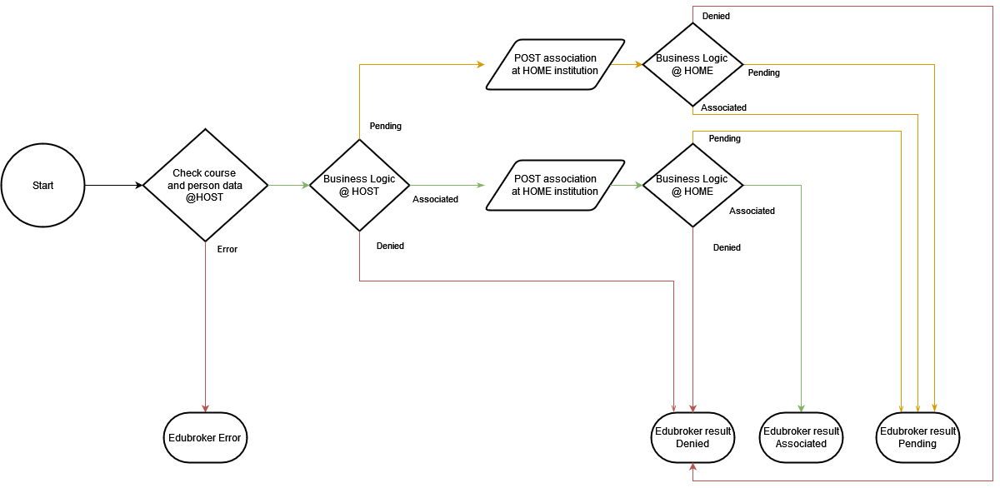

# Association State Flowchart

The flowchart below describes the outcome of association states after the initial application of a student. The student should receive an initial result.

The HOST and HOME institutions each have their own business logic rules they can use to determine the state.

btw: states can change later.

