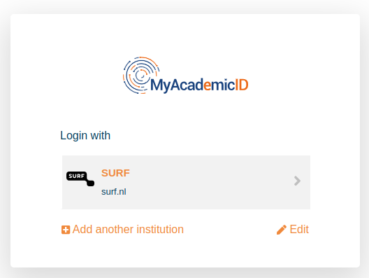
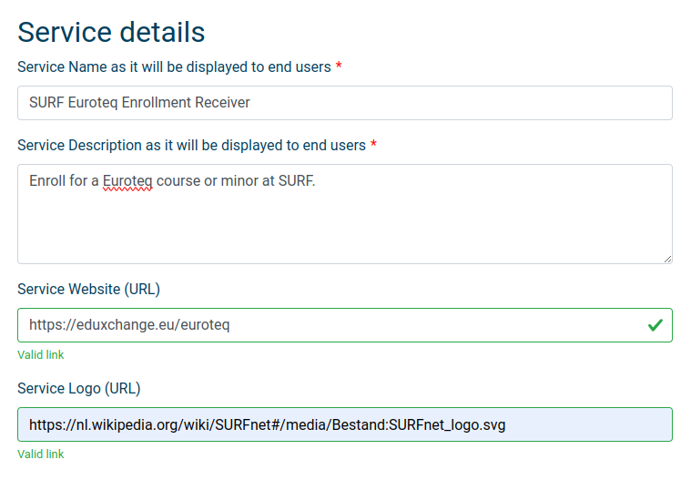
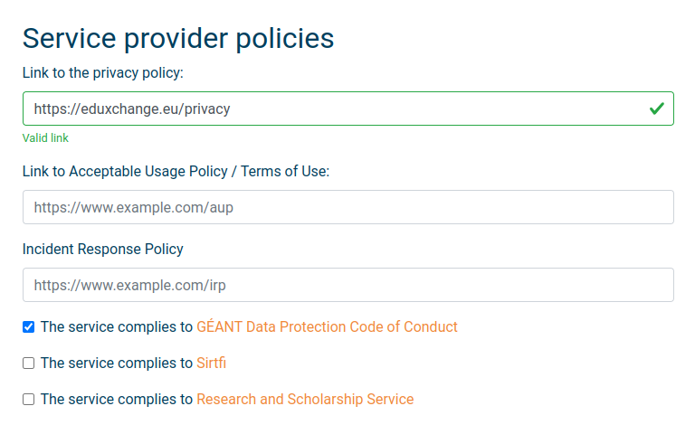
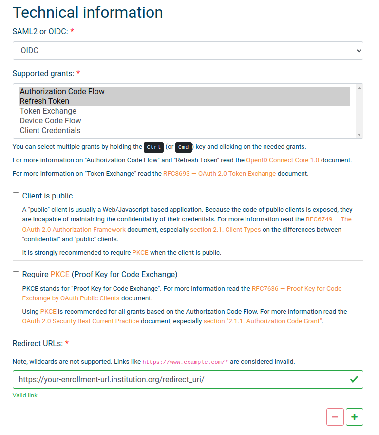

# Registration at MyAcademicID

## Relying Party (RP)

The Generic part of the Enrollment Receiver handles authentication and OIDC
tokens. It should be registerd at the MyAcademicID Service.

1. Go to [the registration form](https://webapp.prod.erasmus.eduteams.org/sp_request)
and log in using your institutional account.

2. Fill in all the fields under `Requester Details` and `Organization information`
3. Enter the service details. Using the name and logo of your institution.

4. Fill in the fields under `Contact information` and
`Service provider policies`. Use [https://eduxchange.eu/privacy](https://eduxchange.eu/privacy)
for the privacy policy.

5. Under `Technical Information`, select `Authorization Code Flow` and
`Refresh Token`. Enter the redirect url as the domein name where the enrollment
receiver can be reached, and add `/redirect_uri/`.

6. Add a comment in  the `Additional information` mentioning this is a euroteq
service.
7. Submit the form. You will receive a confirmation email

## Resource Server (RS)

The Protected OpenEducationAPI endpoints are connected as a resource Server
using [the same form](https://webapp.prod.erasmus.eduteams.org/sp_request) and
information.

Add a comment to the `Additional information` field te indicate this is a
_resource server_, connected to the Euroteq services.
